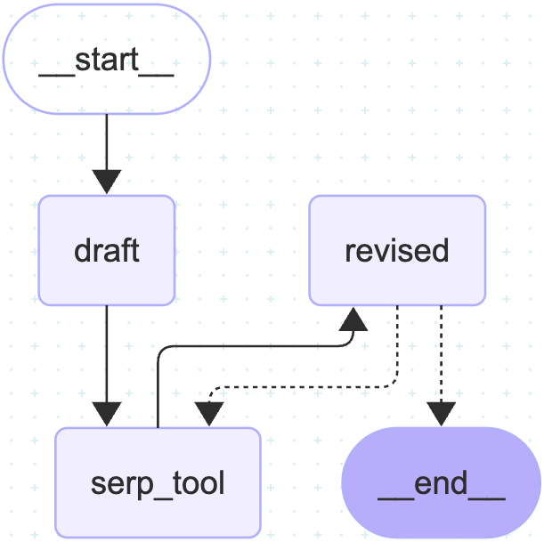

# MCP Integration with SerpAPI, Ollama, and LangGraph

This repository demonstrates how to integrate multiple AI tools and services using a custom MCP (Multi-Component Protocol) server and client setup. The project showcases the following:

1. Showcase how to connect to internet to fetch the latest information using `Internet ai agent and MCP Server`.

2. This `ReAct` model uses `MCP Server`, `LangGraph and LangChain` to write an essay limited to `250 words` with proper citation to the web links regarding any asked questions.

3. Use `Tool` and `StateGraph` from `Langgraph` library to build custome agent to:
      - Ensures real-time data is always fetched
      - Avoids relying on potentially outdated model knowledge.
      - Gives you **full** control over the agent’s behavior.

4. Fetch the response base on the user `input` and:
      - Always invokes a tool first (`serpApi.py`).
      - Then reasons based on the tool output.
      - Use `Langgraph` and `reflexion` method to improve the LLM response.
      - Iterate for continuous Self-Improvement and Learning

5. Below you can find the LangGraph topology of how the Chatbot is interconnected and how it can imptove its response using SerApi to search the web for the latest information.

  <p align="center">
      
  </p>


6. Below also shows the `LangSmith` output of how `LangGraph` uses `SerpApi` to fetch the information from the web and how `LLM` loops internally to make the response improved.

  <p align="center">
      
  </p>


---

## Features

1. **Internet Access via SerpAPI**  
   The MCP server is used to connect to the internet using SerpAPI through the `{@mcp.tool()}` interface. Prompts are also generated using the `{@mcp.prompt()}` interface.

2. **Model Integration**  
   The AI models used in this project are sourced from **Ollama** and **AWS Bedrock**.

3. **MCP Client Configuration**  
   The MCP client is configured to communicate with the MCP tools and prompt servers as follows:

   ```python
   mcp_client = MultiServerMCPClient(
       {
           "websearch": {
               "url": "http://localhost:8001/mcp/",
               "transport": "streamable_http",
           },
           "promptgen": {
               "url": "http://localhost:8002/mcp/",
               "transport": "streamable_http",
           },
       }
   )
   ```

4. Server Requirements
Before running the application, ensure that all MCP servers for tools and prompt generation are up and running.

5. AI Improvement Techniques
The project uses LangGraph, Chain, and Reflexion methods to enhance AI learning and performance.

6. LangGraph Overview
LangGraph is a framework for building stateful, multi-step AI workflows using a graph-based structure. It allows developers to define nodes (representing tasks or decisions) and edges (representing transitions), enabling complex reasoning and memory across steps.

7. Reflexion Overview
Reflexion is a technique that enables AI agents to learn from their past actions by reflecting on failures and successes. It involves analyzing previous outputs, identifying mistakes, and adjusting strategies accordingly. This iterative feedback loop helps improve performance over time, especially in complex or open-ended tasks.

8. Project Tracking with LangSmith
LangSmith is used to monitor and track the progress of the project, including prompt flows, model outputs, and performance metrics.

---
## 🖥️ Running the App
Start the Streamlit frontend:
```bash
  streamlit run main.py
```

- The default LLM model is llama3.2:latest (Ollama)
- You can ask questions and the app will route them to the `SerApi` agent via MCP
---

